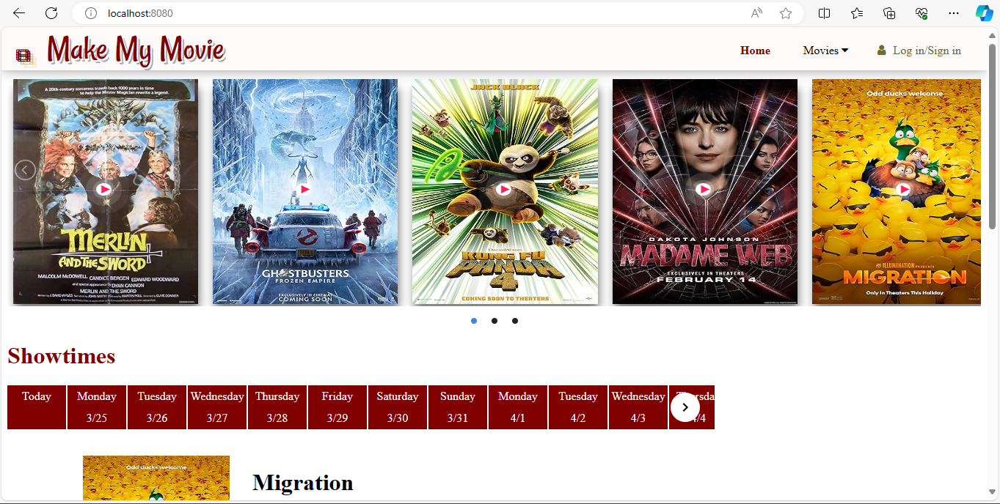
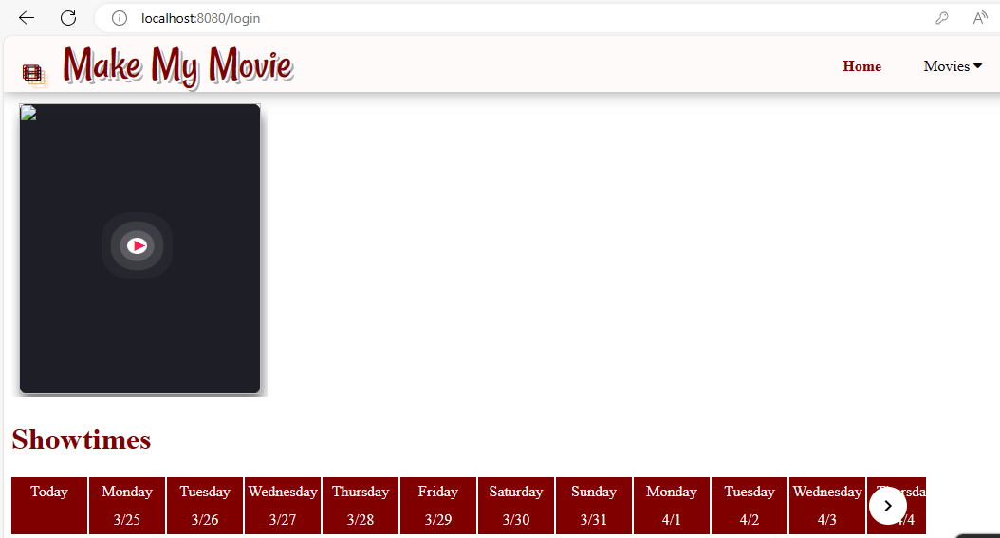

# Make My Movie
This is a movie ticket booking application using Spring Boot, Spring Security,mySQL and HTML/CSS/Bootstrap for the frontend. 

 It Uses API call "http://www.omdbapi.com/?apikey=b79fdda2&t=" to get details about movie.
  

 ## Running MakeMyMovie locally

MakeMyMovie is a [Spring Boot](https://spring.io/guides/gs/spring-boot) application built using [Maven](https://spring.io/guides/gs/maven/). 

### Prerequisites

* Java 17
* Maven
* Your prefered IDE (optional but recommended, I use Intellij)

### Steps:

1) Clone the project from git
```
git clone https://github.com/vanijk/Capstone-OnlineMovieBooking.git
```
2a) In application.properties
   Change your datasourse username and password. This project automatically create Capstone-DB if not exist.
   

2b) Run query in console
    Run capstone-generate-data.sql script to add datas to tables Theater, Screen and SeatMap tables and also to generate admin user.
    
2c) To run using an IDE (Intellij):
From the main menu, choose ```File->Open``` and navigate to the Capstone-OnlineMovieBooking folder cloned from step 1
Right click ```CapstoneOnlineMovieBookingApplication``` class file and choose Run

The application can then be accessed by pointing your browser to http://localhost:8080/

2d) You can see
       because no movies added to the database
      In your browser to http://localhost:8080/admin-page
      use following admin credential
      UserName - admin@makemymovie.com
      passwoed - adminadmin

 2c)You see this page 
     
     click getMovie button 
     Enter Movie Name and Trailer URL 
     ex for Migration Movie 
     movie Name - Migration
     Trailer  - cQfo0HJhCnE (https://www.youtube.com/watch?v=cQfo0HJhCnE) 
     Search movie url in youtube copy the last alphanumeric part after v= paste it to URL input field
     you can see movie get added to the home page  http://localhost:8080/ 
     cross check with your database.
     continuously add movies.

2d) Using Edit Button assign movie to theater - screen - screening Dates - and show time

2e) After admin added and Movies
         User can book movie.

  # Enjoy Your Movie !!! :grinning:      
     
 
      
      

## Contributing

This is intended to be a learning project so please feel free to fork this repo or suggest improvements!

How to reach me - vani.jk@gmail.com
